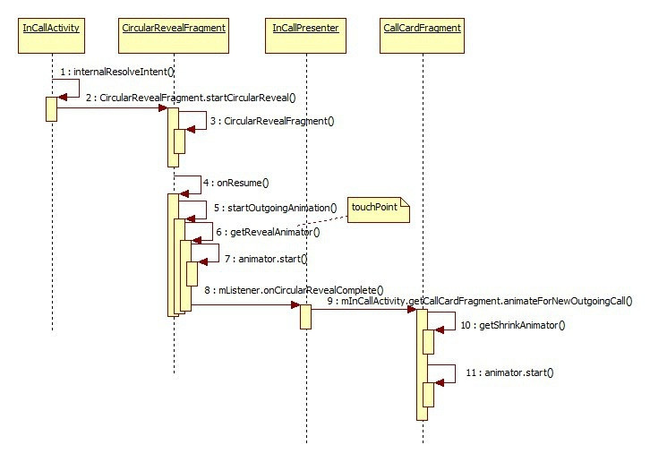
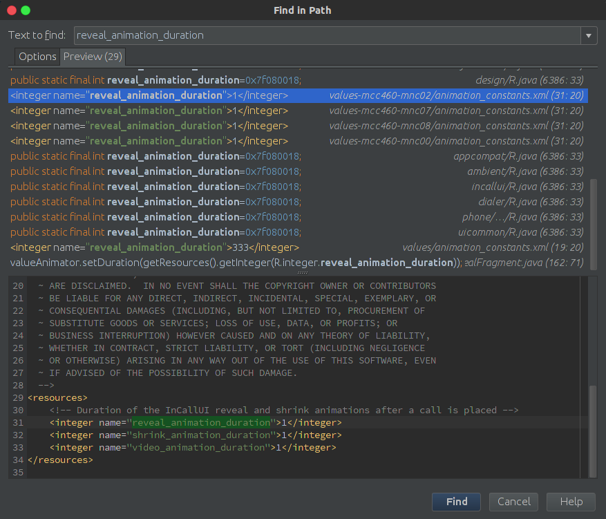
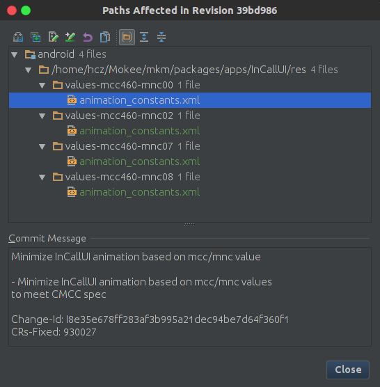

本篇回答下面几个问题：
1. 显示动画的流程是怎样的？
2. 为什么有些手机的动画不一样甚至没有动画？

写这一篇主要用两个原因，1.发现Android M上新增了一个类CircularRevealFragment.java，那么新的东西就像看看它是干什么的；2.我手机上没有打电话的动画！！

代码中两处动画，一处是InCallActivity显示动画，就是那个由一个点展开的动画，另一个是CallCard的动画，就是由下方升到上方的动画。
#InCallActivity启动动画
在InCallActivity.java的internalResolveIntent()方法内（这个方法接收处理intent，必走），跳至 CircularRevealFragment.java
touchPoint即动画展开的那个点。可以看到这个touchPoint有两个取值的地方，这个有点类似于双保险，TouchPointManager中getPoint()取出来的值是点击的时候就保存到TouchPointManager中的，而`(Point) extras.getParcelable(TouchPointManager.TOUCH_POINT);`是在构造拨号的intent的时候存进去的
```java
        Point touchPoint = null;
            if (TouchPointManager.getInstance().hasValidPoint()) {
                // Use the most immediate touch point in the InCallUi if available
                touchPoint = TouchPointManager.getInstance().getPoint();
            } else {
                // Otherwise retrieve the touch point from the call intent
                if (call != null) {
                    touchPoint = (Point) extras.getParcelable(TouchPointManager.TOUCH_POINT);
                }
            }

            // Start animation for new outgoing call
            CircularRevealFragment.startCircularReveal(getFragmentManager(), touchPoint,
                    InCallPresenter.getInstance());
```
touchPoint每次点击的时候都应当set一次，举个DialtacsActivity.java里的例子，当然还有其他地方设置（能点的地方就应该设置一次）：
```java
    @Override
    public boolean dispatchTouchEvent(MotionEvent ev) {
        if (ev.getAction() == MotionEvent.ACTION_DOWN) {
            TouchPointManager.getInstance().setPoint((int) ev.getRawX(), (int) ev.getRawY());
        }
        return super.dispatchTouchEvent(ev);

    }
```
CircularRevealFragment.java新增类
```java
    public static void startCircularReveal(FragmentManager fm, Point touchPoint,
            OnCircularRevealCompleteListener listener) {
        if (fm.findFragmentByTag(TAG) == null) {
            fm.beginTransaction().add(R.id.main,
                    new CircularRevealFragment(touchPoint, listener), TAG)
                            .commitAllowingStateLoss();
        } else {
            Log.w(TAG, "An instance of CircularRevealFragment already exists");
        }
    }

```
然后在 CircularRevealFragment.java的onResume()方法内
```java
    @Override
    public void onResume() {
        super.onResume();
        if (!mAnimationStarted) {
            // Only run the animation once for each instance of the fragment
            startOutgoingAnimation(InCallPresenter.getInstance().getThemeColors());//带了一个 ThemeColors展开动画
        }
        mAnimationStarted = true;
    }
```
这里观察到一个现象，插卡和不插卡通话背景是不同的，双卡手机上两张卡拨打出去的动画背景可能也是不同的，就是因为上面的getThemeColors()返回的值也就是颜色不同。返回值的来源不具体跟了，设置这个颜色的地方在Settings>Sim Card 设置页点开sim卡有个颜色选择，背景色就是这里的颜色。
下面的方法新建动画并启动动画
```java
    public void startOutgoingAnimation(MaterialPalette palette) {
       //略过本次不关心的
        view.getViewTreeObserver().addOnPreDrawListener(new OnPreDrawListener() {
            @Override
            public boolean onPreDraw() {
                final ViewTreeObserver vto = view.getViewTreeObserver();
                if (vto.isAlive()) {
                    vto.removeOnPreDrawListener(this);
                }
                final Animator animator = getRevealAnimator(mTouchPoint);//获得动画
                animator.addListener(new AnimatorListenerAdapter() {
                    @Override
                    public void onAnimationEnd(Animator animation) {
                        view.setClipToOutline(false);
                        if (mListener != null) {
                            android.util.Log.i(TAG, "onAnimationEnd: animation a");
                            mListener.onCircularRevealComplete(getFragmentManager());//动画结束后调
                        }
                    }
                });
                android.util.Log.i(TAG, "onPreDraw: animation 3");
                animator.start();//动画开始了
                return false;
            }
        });
    }
```
好的诸位下面就是动画生成的地方，注意动画类型，这里携带了touchPoint
```java
 private Animator getRevealAnimator(Point touchPoint) {
        final Activity activity = getActivity();
        final View view  = activity.getWindow().getDecorView();
        final Display display = activity.getWindowManager().getDefaultDisplay();
        final Point size = new Point();
        display.getSize(size);

        int startX = size.x / 2;
        int startY = size.y / 2;
        if (touchPoint != null) {
            startX = touchPoint.x;
            startY = touchPoint.y;
        }

        final Animator valueAnimator = ViewAnimationUtils.createCircularReveal(view,
                startX, startY, 0, Math.max(size.x, size.y));
        valueAnimator.setDuration(getResources().getInteger(R.integer.reveal_animation_duration));//设置动画时长
        return valueAnimator;
    }
```
好的InCallActivity的动画显示完以后，下面接着CallCardFragment的动画。
#CallCard动画
在动画执行完InCallActivity的启动动画以后，通过mListener.onCircularRevealComplete(getFragmentManager());调用CallCardFragement.java中的 animateForNewOutgoingCall()
InCallPresenter.java
```java
    public void onCircularRevealComplete(FragmentManager fm) {
        if (mInCallActivity != null) {
            mInCallActivity.showCallCardFragment(true);//显示CallCard
            mInCallActivity.getCallCardFragment().animateForNewOutgoingCall();//CallCardFragment中显示动画
            CircularRevealFragment.endCircularReveal(mInCallActivity.getFragmentManager());
        }
    }
```

CallCardFragment.java
关注一下动画类型
```java
    @Override
    public void animateForNewOutgoingCall() {
        //略过本次不关心的
        observer.addOnGlobalLayoutListener(new OnGlobalLayoutListener() {
            @Override
            public void onGlobalLayout() {
                 //略过本次不关心的
                final Animator animator = getShrinkAnimator(parent.getHeight(), originalHeight);//注意动画类型

                animator.addListener(new AnimatorListenerAdapter() {
                    @Override
                    public void onAnimationEnd(Animator animation) {
                        mPrimaryCallCardContainer.setTag(R.id.view_tag_callcard_actual_height,
                                null);
                        setViewStatePostAnimation(listener);
                        mIsAnimating = false;
                        InCallPresenter.getInstance().onShrinkAnimationComplete();//动画结束后
                    }
                });
                animator.start();//开始动画
            }
        });
    }

```
getShrinkAnimator()动画生成
```java
    /**
     * Animator that performs the upwards shrinking animation of the blue call card scrim.
     * At the start of the animation, each child view is moved downwards by a pre-specified amount
     * and then translated upwards together with the scrim.
     */
    private Animator getShrinkAnimator(int startHeight, int endHeight) {
        final ObjectAnimator shrinkAnimator =
                ObjectAnimator.ofInt(mPrimaryCallCardContainer, "bottom", startHeight, endHeight);
        shrinkAnimator.setDuration(mShrinkAnimationDuration);//设置动画时长
        shrinkAnimator.addListener(new AnimatorListenerAdapter() {
            @Override
            public void onAnimationStart(Animator animation) {
                mFloatingActionButton.setEnabled(true);
            }
        });
        shrinkAnimator.setInterpolator(AnimUtils.EASE_IN);
        return shrinkAnimator;
    }
```
动画时长来源：
`mShrinkAnimationDuration = getResources().getInteger(R.integer.shrink_animation_duration);`

---
好了现在我们回头看看文章开头的两个问题是否得到了解答。
前面的流程基本上就是动画生成,设置属性,显示动画的流程，
非要话个图的话大概就是下面这样

如果我们把Android M上的动画代码跟Android L上的代码做对比的话会发现，Android L也有这两个类型的动画，都在CallCardFragment.java里，通过`mAnimatorSet.playSequentially(revealAnimator, shrinkAnimator);`顺序播放两个动画。

第二个问题的答案貌似还不明显，为什么有些手机的动画不一样？
我们观察到的不同有两点：1.背景颜色不同，2.有些似乎没有动画。
第1点不重点解答，上文也提到过颜色取值自SIM卡设置里面选择的颜色，而且颜色不同起码有动画嘛；
第2点有又两种情况：1）没用动画；2）动画时间极短，以至于看起来像没有动画。
注意到两次设置动画时间的代码分别是：
```java
//InCallActivity或者说叫CircularRevealFragment
valueAnimator.setDuration(getResources().getInteger(R.integer.reveal_animation_duration));
//CallCardFragment
mShrinkAnimationDuration = getResources().getInteger(R.integer.shrink_animation_duration);
```
那么这两个值的来源呢?

从上图中可以看到，这个动画时长默认是333ms的，但是在有些配置文件里面是1，而且都改成了1！！从他们所在的文件夹可以看到，这个配置是针对中国移动sim卡的修改（mcc mnc 匹配到中国移动），难道是针对中国移动定制机的修改？苦了我刷CM系统的人们（AOSP没这个配置）。
是哪个家伙做了这样的修改（黑线脸）？！


提交者就不贴出来了，他针对中国移动新增了这4个文件配置动画时长。。
**题外：**
从这里又可以看出一点，嫌通话界面启动慢的可以改动画时长，这也是有时候所谓的“性能要求”/“相应时间”。
完。