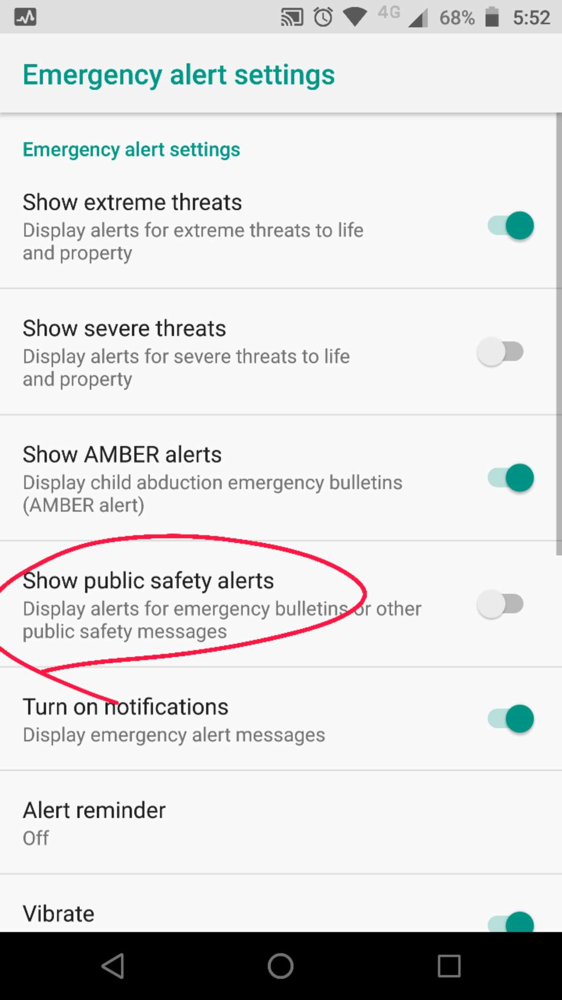
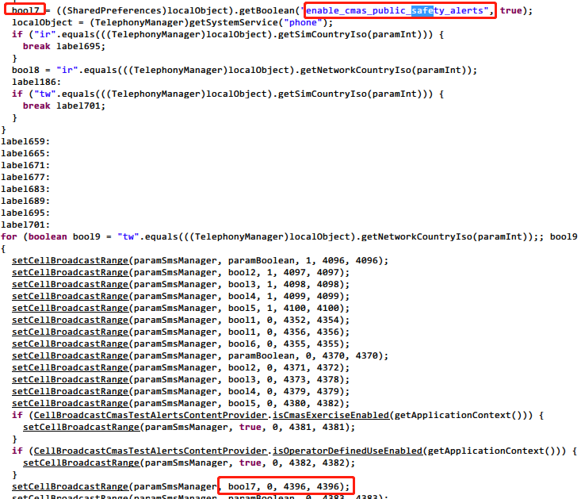

# 需求   
需要知道当前手机支不支持接收Public Safety Message。  
  
# 分析  
那其中一个方法就是调查手机内是否预置了预置对应的Identifier。  
可现在的问题是，Public Safety Message 对应的Identifier 是什么？  
  
# 调查  
  
## 方法一 网络搜索  
Google Bing Baidu， 各种搜索引擎尝试了一遍，尝试了多个关键字组合，无果。  
  
## 方法二 反编译厂商apk  
恰逢我的moto z 手机刷了oem test 版本的android 8.0，估计入为了满足入网条件，在系统的“紧急警报”中恰好就有“显示公共安全提示”这个开关。系统切换语言到英文后得到下图：  

因为是厂商的ROM 包，已经把apk 包中的dex提取出来转成了odex， 而且很可能framework 已经定制过，所以仅反编译CellBroadcastReceiver.apk 可能会失败或者有其他问题，建议使用 SVADeodexerForArt自动合并框架工具重新合并得到apk。   
  
打开SVADeodexerForArt ，选择我们解压好的目录至system下。依次全部勾选下面三个选项，点击Execute后就会出现下面这幅图的样子，只需要静静等待几分钟就可以了。他会将odex资源与apk进行合并。   
  
  
  
之后我们得到新的CellBroadcastReceiver.apk，之后按照常规的反编译方法即可。  
  
使用jd-gui 工具查看反编译后的代码：  
  

  
到这里我们就得到了 **Public Safety Alerts 对应的Identifer 为4396**。