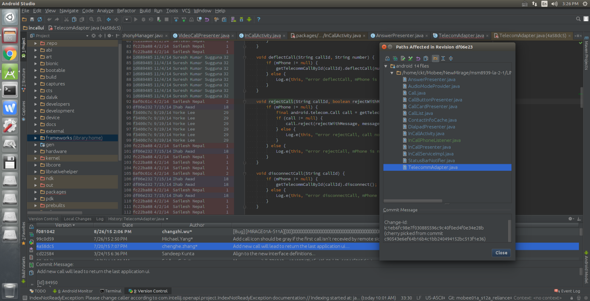

Version Control in Android Studio II
经过一段时间的使用，我又发现了AS的一些新功能，写出来分享一下。

# 一. Annotate
单个文件History中的Annotate功能,这个功能能做什么呢?用一句话说就是它能让你简单直接明了的看到每一行代码是由什么人在什么时候因为什么修改的!扩展一点,还能很方便的知道当时修改了哪些文件,而哪些文件已经不存在了.

下面我用一个例子展示以一下。
比如说我在解决一个通话相关bug的时候发现,在通话结束后,如果我们已经选择了使用短信拒接,那么这个窗口弹出来后,并不会因为通话的结束而消失.
简单分析后就是负责显示来电的界面没有消失,自然的我们去查看InCallActivity的finish()方法.

下面我们就来用一下Annotate功能:


我们把鼠标放到if (!hasPendingErrorDialog() && !mAnswerFragment.hasPendingDialogs()) { 这行代码对应的左侧，然后就显示出如上图的信息，包括commit id，作者，日期，commit message和changeId。

点击的话则会弹出新的窗口

这个窗口里显示出了本次提交修改了那些文件，双击一个文件则显示本次这个文件修改了那些内容。
要注意的一点是，你在不同的log上点击Annotate的话，得到的是不同的结果，即每次显示的是那个版本的文件的信息，以及那个文件包括的内容的各行修改历史。

好现在我们知道了这行代码添加的时候是为了“Adds support for texting after phone disconnects”,就是为了添加一个功能，在电话断开的时候仍然可以发送短信，修改时间是2013.10.08。这显然是与现在的情况不符的，那我让我们继续分析。

通过debug我们得知，之所以短信没能发送出去，是因为在后续的流程中执行到

```java
	void rejectCall(String callId, boolean rejectWithMessage, String message) {
	       if (mPhone != null) {
	           final android.telecom.Call call = getTelecommCallById(callId);
	           if (call != null) {
	               call.reject(rejectWithMessage, message);
	           } else {
	               Log.e(this, "error rejectCall, call not in call list: " + callId);
	           }
	       } else {
	           Log.e(this, "error rejectCall, mPhone is null");
	       }
	   } 
```
的时候mPhone的值已经为null了，然后不能够继续执行了（其实就算这里可以执行过去，后面仍然不能发送短信，因为call不存在了）。
那么我们就生出一个疑问：为什么以前可以顺利的执行下去，现在却不可以了呢？难道以前这个条件是满足的么？
我们继续看，这行代码的修改时间：2014.07.15。

可以看到这次貌似是个大工程，改了很多的文件，实际上我们点进去看的话也会发现，这次确实是改了很多的东西。

而我们关注的是：


可以看到判断条件改了。
自此我们可以知道，电话断开后仍然可以发送短信的功能是在2013.10.08添加的，这个功能可能一直正常使用到2014.07.14，然后由于其他原因代码在2014.07.15更改，导致原有流程走不通了。（一年多了都没有人发现这个问题么？）
我们不仅看到了问题出现的原因，通过Annotate这个功能我们也看到了在“历史长河”中代码的演变，看到了代码发展的故事。
补充一个例子，前段时间才遇到的。现象是通话过程中会有解锁屏幕的声音播放。
问题很好容易定位到了，代码中用来保存phone状态的mPhoneState值一直没有更新过，所以尽管播放解锁声音前判断了phone的状态，但因为mPhoneState值不曾变过，所以这条判断一直满足，实际上是没有意义的。
```java
	if (TelephonyManager.EXTRA_STATE_IDLE.equals(mPhoneState)) {
	      playSounds(false);
	  }
```
改起来也容易，但是我觉得如果这个功能是某人添加的话，不应该犯这种简单的错误。
依旧用Annotate看历史。很容易我们找到这个功能是2010年添加的：


并且在后面的几条提交中加入了mPhoneState变量来保存监听到的phone状态的变化值：
```java
	  else if (TelephonyManager.ACTION_PHONE_STATE_CHANGED.equals(action)) {
	      mPhoneState = intent.getStringExtra(TelephonyManager.EXTRA_STATE);
```
但是最新的代码中却没有这两行了，一般来说解bug的话看到这里也可以了，把上面那两行代码在重新加进去就可以解决问题了。
如果想搞清楚来龙去脉，还可以再追一下什么时候给mPhoneState赋值的代码被改没油了。
这一次要多花点时间，因为Annotate不显示不存在的代码的修改时间，其实这时候用查看单个文件的修改历史，点击该次修改要来的快些，不到2分钟我找到了引起这个问题对应的提交 2012.07.18代码clean up的时候把上面两行代码给删了！

好了，到这里我们不仅知道了问题产生的原因（修改代码丢失代码块），连解法也一同找到了。

顺便了解了一下这个解/锁屏功能的历史，2010.02.13添加，并在后续的几条提交中优化，但是在2012.07.18的时候的一次代码清理工作中删除了一部分代码，导致了现在的通话中仍然可以有解锁声音播放。你不觉得2012.07至2015.11这个问题都没有人修改过，时间未免太久了吧？

小结：Annotate结合File History使用，可以方便快速的查看代码修改历史，分析出现象产生的来龙去脉，提高bug的修改效率，简直就是在看代码的演变的故事！

# 二、我忘了O_o//