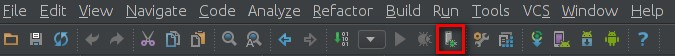

我们假设你已经按照之前第二篇教程配置妥当。

# 选择进程调试
正确配置以后下图红框内的按钮应该是可以点击的

之后弹出选择进程（userdebug系统），可像图中一样搜索进程名称

之后就是这个样子：

# 一些断点技巧
1. 日志断点：
  描述：这是一种打印日志而不是暂停的断点，当你想打印一些日志信息但是不想添加log代码后重新编译代码，这是一个非常有用的操作。
  调用：在断点上右键，取消Suspend的勾选，然后勾选上Log evaluated Expression，并在输入框中输入你要打印的日志信息。
  

2. 条件断点：
  描述：简单说，就是当设定的条件满足时，才会触发断点。你可以基于当前范围输入一个java布尔表达式，并且条件输入框内是支持代码补全的。
  调用：右键需要填写表达式的断点，然后输入布尔表达式。
  

3. 书签和断点管理
  左下窗口，书签可按Shift + F11，断点可按Ctrl+shift+F8
  书签
  
  断点
  
# 分析变量传递和crash问题
1. 分析传入数据流：
  描述：这个操作将会根据当前选中的变量、参数或者字段，分析出其传递到此处的路径。 当你进入某段陌生的代码，试图明白某个参数是怎么传递到此处的时候，这是一个非常有用的操作。
  调用：右键 → Analyze → Analyze Data Flow to Here
  相反的操作：分析传出数据流（Analyze data flow from here），这个将会分析当前选中的变量往下传递的路径，直到结束。

  PS:另有快捷键查看**方法**的调用 Ctrl + Shift + H(可能与系统快捷键冲突)

2. 堆栈追踪分析：
  描述： 这个操作读取一份堆栈追踪信息，并且使它像logcat中那样可以点击。当你从bug报告中（log）或者终端复制了一份堆栈追踪，使用该操作可以很方便地调试。
  调用：右键 → Analyze → Analyze Stacktrace
