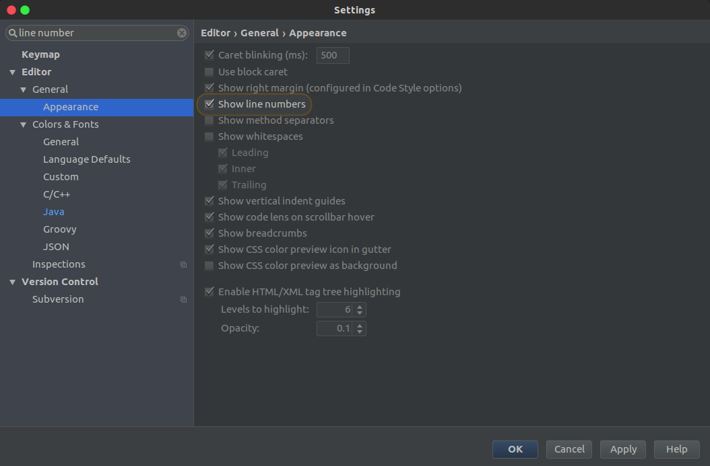
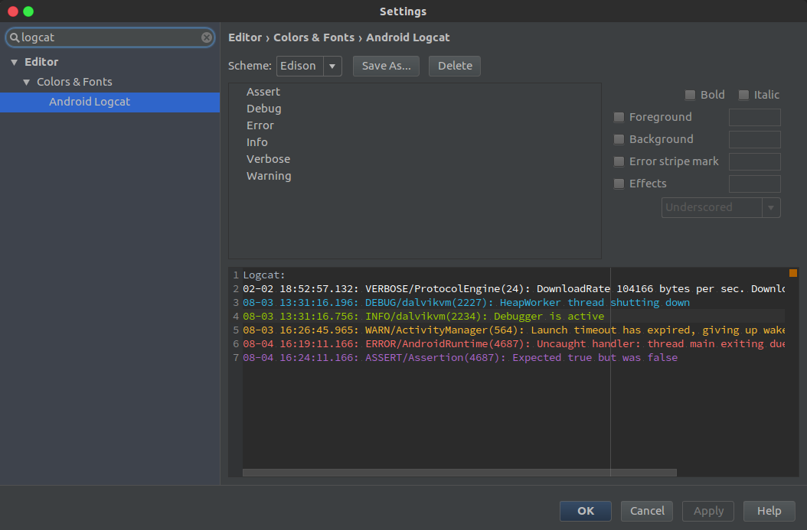
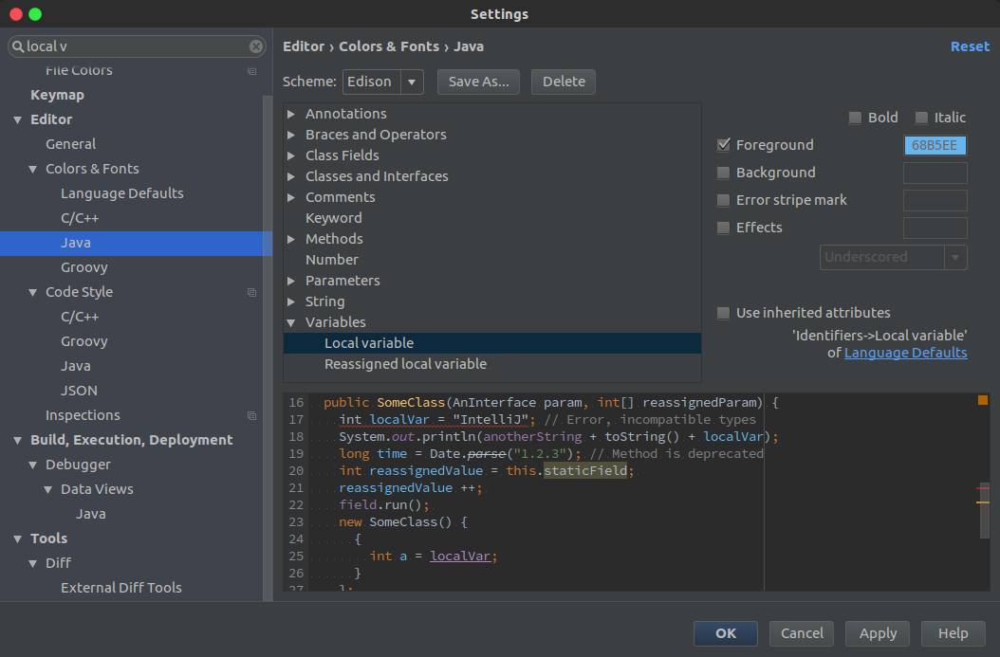
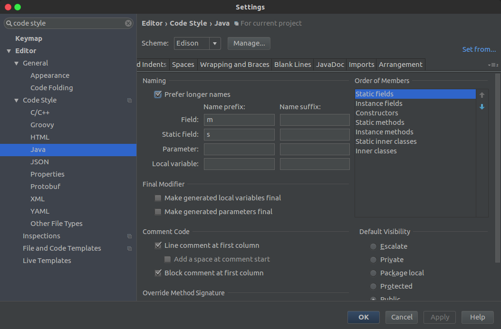
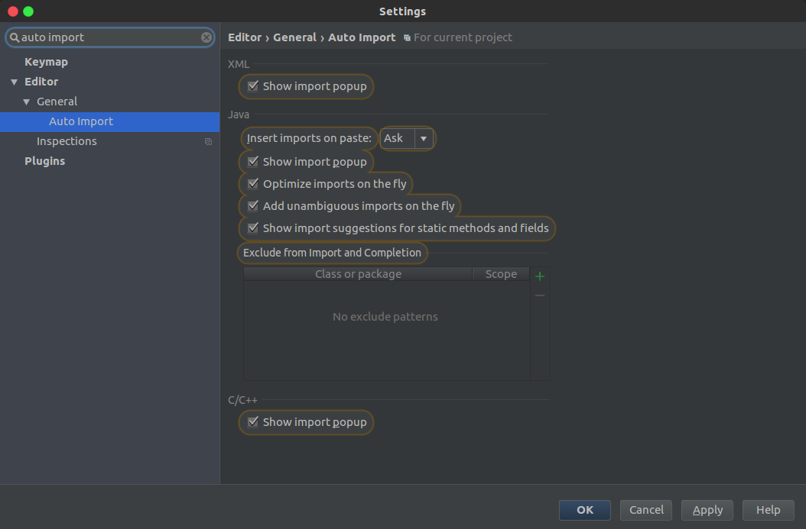
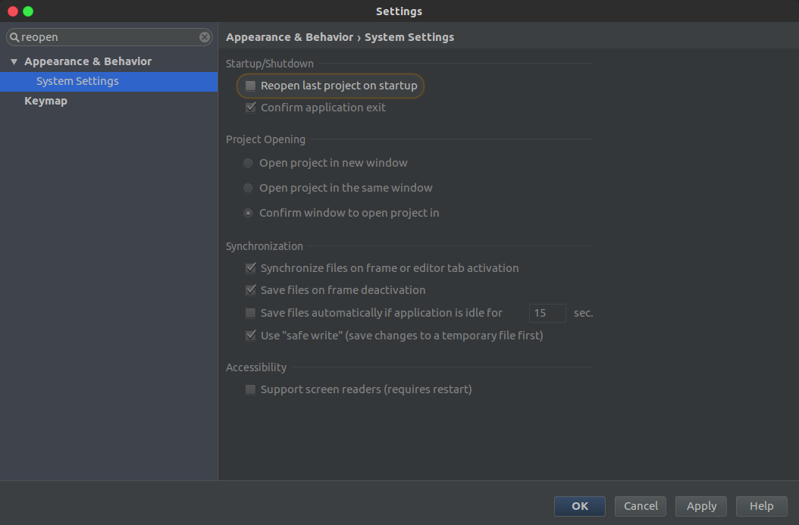
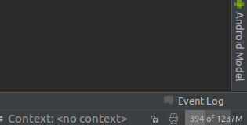

# Android Studio自用配置备份
已修改：
- 显示行号
  
- logcat各级log颜色
  
- 局部变量颜色
  
- 变量前缀
  
- 自动导包
  
- 取消自动打开上次工程
  
- 右下角显示内存使用量，点击可释放内存（类似GC？）  
  

github地址 [https://github.com/hcz017/AndroidStudioConfig](https://github.com/hcz017/AndroidStudioConfig)

---
- 推荐插件
- [android-material-design-icon-generator-plugin](https://github.com/konifar/android-material-design-icon-generator-plugin)
  This plugin help you to set material design icon to your project.
  这个插件提供了很多MD图标，很多xml文件绘制的图标，可选颜色。