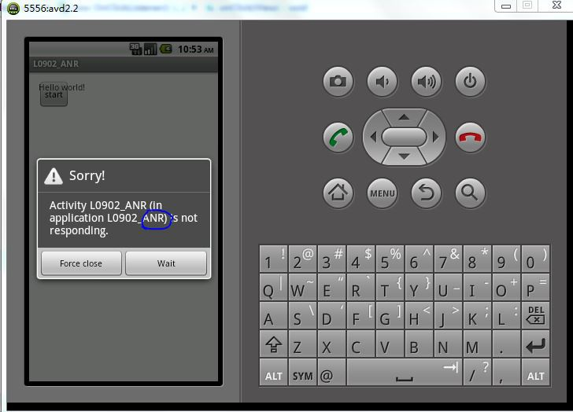
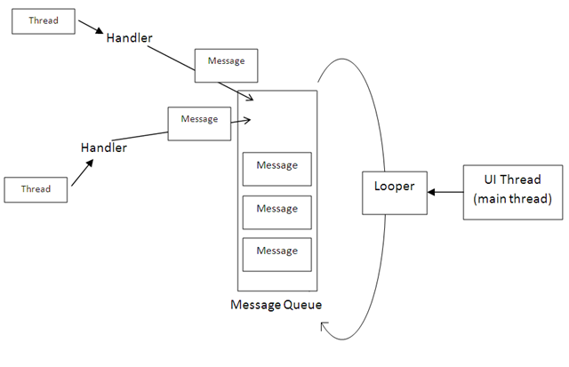
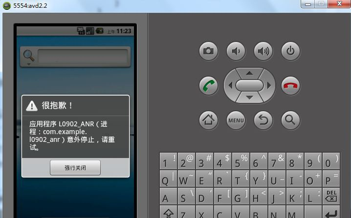
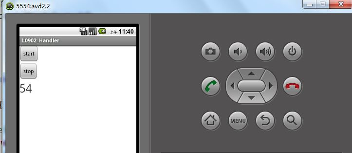
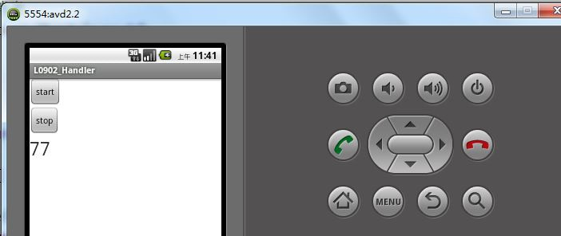
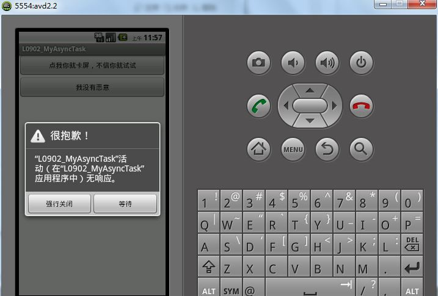
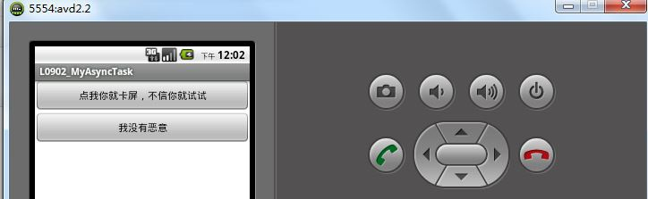
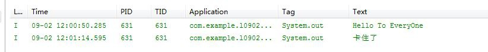
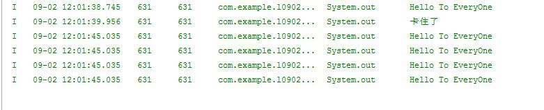
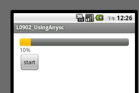

## 一.Android进程的分类： ##
（1）前台进程：即与用户正在交互的Activity或者Activity用到的Service等，如果系统内存不足时前台进程是最后被杀死的；  
（2）可见进程：可以是处于暂停状态（onPause）的Activity或者绑定在其上的Service，即被用户可见，但由于失去了焦点而不能与用户交互；  
（3）服务进程：其中运行着使用startService方法启动的Service，虽然不被用户可见，但是却是用户关系的，例如用户正在非音乐界面听的音乐或者正在非下载页面自己下载的文件等；当系统要用空间运行前两者进程时才会被终止；  
（4）后台进程：其中运行着执行onStop方法而停止的程序，但是却不是用户当前关心的，例如后台挂着的QQ，这样的进程系统一旦没有内存就首先被杀死；  
（5）空进程：不包含任何应用程序的程序组件的进程，这样的进程系统是一般不会让他存在的；  
## 
二.进程与多线程的深入 ##
1.由于单线程而导致的ANR错误：
   ANR错误（Application Not Responding），指主UI进程被阻塞超过5秒钟而出现的错误，它会终止程序的正常运行，我们要避免它 ，而产生ANR错误的原因就是：单线程。
例子如下：

	
	package com.example.l0902_anr;
	import android.app.Activity;
	import android.os.Bundle;
	import android.view.View;
	import android.view.View.OnClickListener;
	import android.widget.Button;
	import android.widget.TextView;
	public class MainActivity extends Activity {
	private Button btn;
	    @Override
	    protected void onCreate(Bundle savedInstanceState) {
	        super.onCreate(savedInstanceState);
	        setContentView(R.layout.activity_main);
	        btn=(Button) findViewById(R.id.btn);
	        btn.setOnClickListener(new OnClickListener() {
	                                                                                                                                                                                                                                                                                                                                                                                                                                                     
	            @Override
	            public void onClick(View v) {
	                int count=0;
	                while(count<1000){
	                    count++;
	                    try {
	                        Thread.sleep(1000);
	                    } catch (InterruptedException e) {
	                        e.printStackTrace();
	                    }
	                }
	            }
	        });
	                                                                                                                                                                                                                                                                                                                                                                                                                                                 
	    }
	}
运行效果如下：

   OK，上面的程序出问题的原因是单线程，那么我们可以再创建一个线程去处理耗时操作，就不会阻碍主UI的操作了：
   改动上面的程序如下：

	package com.example.l0902_anr;
	import android.app.Activity;
	import android.os.Bundle;
	import android.view.View;
	import android.view.View.OnClickListener;
	import android.widget.Button;
	public class MainActivity extends Activity {
	private Button btn,btn_stop;
	private Thread thread;
	    @Override
	    protected void onCreate(Bundle savedInstanceState) {
	        super.onCreate(savedInstanceState);
	        setContentView(R.layout.activity_main);
	        btn=(Button) findViewById(R.id.btn);
	        btn_stop=(Button) findViewById(R.id.button1);
	        btn.setOnClickListener(new OnClickListener() {
	            @Override
	            public void onClick(View v) {
	                thread=new Thread(new Runnable() {
	                    @Override
	                    public void run() {
	                        int count=0;
	                        while(count<1000){
	                            count++;
	                            try {
	                                Thread.sleep(1000);
	                            } catch (InterruptedException e) {
	                                e.printStackTrace();
	                            }
	                            System.out.println(count);
	                        }
	                    }
	                });
	                thread.start();//启动线程
	            }
	        });
	        btn_stop.setOnClickListener(new OnClickListener() {
	            @Override
	            public void onClick(View v) {
	                thread.stop();//停止线程
	            }
	        });
	    }
	}
   运行效果如下：

   代码写到这里，ANR错误就解决了，但是又出现一个新的问题，如果我想把利用新的线程来更新主UI线程，可以不可以呢，好吧，我们用上面的程序试一试，加一个TextView来接收新的线程中自增的数据，看看是否能实现：
   程序修改如下：

	package com.example.l0902_anr;
	import android.app.Activity;
	import android.os.Bundle;
	import android.view.View;
	import android.view.View.OnClickListener;
	import android.widget.Button;
	import android.widget.TextView;
	public class MainActivity extends Activity {
	private Button btn;
	private TextView tv;
	    @Override
	    protected void onCreate(Bundle savedInstanceState) {
	        super.onCreate(savedInstanceState);
	        setContentView(R.layout.activity_main);
	        btn=(Button) findViewById(R.id.btn);
	        tv=(TextView) findViewById(R.id.tv);
	        btn.setOnClickListener(new OnClickListener() {
	            @Override
	            public void onClick(View v) {
	                new Thread(new Runnable() {
	                    @Override
	                    public void run() {
	                        int count=0;
	                        while(count<1000){
	                            count++;
	                            tv.setText(count+"");//试图更新主UI线程
	                            try {
	                                Thread.sleep(1000);
	                            } catch (InterruptedException e) {
	                                e.printStackTrace();
	                            }
	                        }
	                    }
	                }).start();//启动线程
	            }
	        });
	    }
	}

   运行效果如下：

   我们可以看到程序被意外终止了，那么说明其他线程是不能更改主UI的数据的，除非...除非我们往下看...

2.Android线程之间的通信——Handler
   其实，Android线程之间的通信不只是Handler，还需要Message，MessageQueue，Looper的相互使用，Android线程通信模型如下：
201105060841318425.png
（1）Message：即要传递的消息；
（2）MessageQueue：存放消息的队列；
（3）Looper：用于创建MessageQueue以及循环使用其中的Message；
（4）Handler：用于消息的传递了；
好了，我们直接看下面的例子吧：

	package com.example.l0902_handler;
	import android.annotation.SuppressLint;
	import android.app.Activity;
	import android.os.Bundle;
	import android.os.Handler;
	import android.os.Message;
	import android.view.View;
	import android.view.View.OnClickListener;
	import android.widget.Button;
	import android.widget.TextView;
	public class MainActivity extends Activity {
	    private Button btn_start,btn_stop;
	    private TextView tv;
	    private int i=0;
	    @Override
	    protected void onCreate(Bundle savedInstanceState) {
	        super.onCreate(savedInstanceState);
	        setContentView(R.layout.activity_main);
	        btn_start=(Button) findViewById(R.id.button1);
	        btn_stop=(Button) findViewById(R.id.button2);
	        tv=(TextView) findViewById(R.id.textView1);
	        btn_start.setOnClickListener(new OnClickListener() {
	            @Override
	            public void onClick(View v) {
	                //开始发送消息
	                handler.post(runnabl);
	            }
	        });
	        btn_stop.setOnClickListener(new OnClickListener() {
	            @Override
	            public void onClick(View v) {
	                //停止发送消息
	                handler.removeCallbacks(runnabl);
	            }
	        });
	    }
	    //创建新的线程
	    private Runnable runnabl=new Runnable() {
	        @Override
	        public void run() {
	            i++;
	            //使用Message封装非UI线程的消息
	            Message m=new Message();
	            //使用Message的arg1属性或者arg2属性传递int类型的消息效率高
	            m.arg1=i;
	            //使用Handler发送消息
	            handler.sendMessage(m);
	        }
	    };
	    @SuppressLint("HandlerLeak")
	    private Handler handler=new Handler(){
	        public void handleMessage(Message m){
	            System.out.println(m.arg1);
	            String str=m.arg1+"";
	            //注意：一定一定要记得TextView是String类型哦
	            tv.setText(str);
	            handler.post(runnabl);
	        }
	    };
	}
   运行结果如下：

   看到了吧，主UI的数据是不是更新了呢，很是神奇吧，这就是线程之间的通信了。
   接下来我们要继续讲一个线程通信的机制。。。

3.简化多线程通信开发的——AsyncTask
   我们直接用例子说明AsyncTask的使用吧：
（1）我们同样也先写一个类似上面的ANR错误的卡屏的例子：

	
	package com.example.l0902_myasynctask;
	import android.app.Activity;
	import android.os.Bundle;
	import android.view.View;
	import android.view.View.OnClickListener;
	import android.widget.Button;
	public class MainActivity extends Activity {
	    private Button btn1,btn2;
	    @Override
	    protected void onCreate(Bundle savedInstanceState) {
	        super.onCreate(savedInstanceState);
	        setContentView(R.layout.activity_main);
	        btn1=(Button) findViewById(R.id.button1);
	        btn2=(Button) findViewById(R.id.button2);
	        btn1.setOnClickListener(new OnClickListener() {
	            @Override
	            public void onClick(View v) {
	                try {
	                    //超过5秒了，其实就和前面的例子一样了（ANR错误）
	                    Thread.sleep(7000);
	                } catch (InterruptedException e) {
	                    e.printStackTrace();
	                }
	            }
	        });
	        btn2.setOnClickListener(new OnClickListener() {
	            @Override
	            public void onClick(View v) {
	                System.out.println("Hello To EveryOne");
	            }
	        });
	    }
	}
   运行效果如下：

   如果把上面等待的时间改为5以内，则就是典型的卡屏的例子了，试试看吧：
初始界面：

点击下面的按钮：

点击上面的按钮：此时就卡住了，屏幕什么都干不了了

卡屏期间点击了多少下下边的按钮，5秒之后都会显示出来：

上面就是经典的卡屏的例子，怎么解决呢？当然是：AsyncTask了
（2）使用AsyncTask创建后台进程，解决卡屏问题：
代码如下：
MainActivity.java

	
	package com.example.l0902_myasynctask;
	import android.app.Activity;
	import android.os.Bundle;
	import android.view.View;
	import android.view.View.OnClickListener;
	import android.widget.Button;
	public class MainActivity extends Activity {
	    private Button btn1,btn2;
	    @Override
	    protected void onCreate(Bundle savedInstanceState) {
	        super.onCreate(savedInstanceState);
	        setContentView(R.layout.activity_main);
	        btn1=(Button) findViewById(R.id.button1);
	        btn2=(Button) findViewById(R.id.button2);
	        btn1.setOnClickListener(new OnClickListener() {
	            @Override
	            public void onClick(View v) {
	                //创建AsyncTask并执行
	                new MyAsyncTask().execute();
	            }
	        });
	        btn2.setOnClickListener(new OnClickListener() {
	            @Override
	            public void onClick(View v) {
	                System.out.println("Hello To EveryOne");
	            }
	        });
	    }
	}
MyAsyncTask.java：

	
	package com.example.l0902_myasynctask;
	import android.os.AsyncTask;
	/**
	 * 在后台创建线程，不会出现卡屏现象
	 * @author asus
	 */
	public class MyAsyncTask extends AsyncTask<Void, Void, String>{
	    //核心方法，在后台启动一个线程
	    @Override
	    protected String doInVoid...  params) {
	        try {
	            Thread.sleep(5000);
	        } catch (InterruptedException e) {
	            e.printStackTrace();
	        }
	        return null;
	    }
	}
运行效果我们就不再给出了，描述一下就可以了，即无论我们是否按卡屏按钮，执行按钮都能正常输出，这正是因为AsyncTask创建了一个后台进程来处理耗时功能，不影响主UI的正常功能的处理。

（3）最后总结一个使用AsyncTask的例子——下载滚动条的进度：
MainActivity.java：

	package com.example.l0902_usinganysc;
	import android.app.Activity;
	import android.os.Bundle;
	import android.view.View;
	import android.view.View.OnClickListener;
	import android.widget.Button;
	import android.widget.ProgressBar;
	import android.widget.TextView;
	public class MainActivity extends Activity {
	    private Button btn;
	    private ProgressBar bar;
	    private TextView tv;
	    @Override
	    protected void onCreate(Bundle savedInstanceState) {
	        super.onCreate(savedInstanceState);
	        setContentView(R.layout.activity_main);
	        btn=(Button) findViewById(R.id.button1);
	        bar=(ProgressBar) findViewById(R.id.progressBar1);
	        tv=(TextView) findViewById(R.id.textView1);
	        tv.setText("开始下载");
	        btn.setOnClickListener(new OnClickListener() {
	                                                        
	            @Override
	            public void onClick(View v) {
	                MyAsyncTask my=new MyAsyncTask(tv, bar);
	                my.execute("","i=","打开文件");//启动方法
	            }
	        });
	    }
	}
MyAsyncTask.java：

	
	package com.example.l0902_usinganysc;
	import android.os.AsyncTask;
	import android.widget.ProgressBar;
	import android.widget.TextView;
	/**
	 * 总结：参数相关
	 * @author asus
	 */
	public class MyAsyncTask extends AsyncTask<String, Integer, String>{
	    private ProgressBar bar;
	    private TextView tv;
	    //构造方法，初始化ProgressBar和TextView
	    public MyAsyncTask(TextView tv,ProgressBar bar){
	        this.bar=bar;
	        this.tv=tv;
	    }
	    /*
	     * 这个方法的参数不能改,其返回类型与第三个参数一致，其参数与第一个参数类型一致
	     * (non-Javadoc)
	     * @see android.os.AsyncTask#doInParams[])
	      */
	    @Override
	    protected String doInString...  params) {//可变参数
	        String p1=params[1];
	        String p2=params[2];
	        int i=1;
	        for(i=1;i<=100;i++){
	            try {
	                Thread.sleep(100);
	            } catch (InterruptedException e) {
	                e.printStackTrace();
	            }
	            publishProgress(i);
	        }
	        return p1+i+p2;//也作为下一个方法的参数
	    }
	    /*
	     * 当异步结束时触发此方法，其参数类型与第三个参数类型一致
	     * (non-Javadoc)
	     * @see android.os.AsyncTask#onPostExecute(java.lang.Object)
	     */
	    @Override
	    protected void onPostExecute(String result) {
	        if(result!=null){
	            tv.setText("下载完成"/*+result*/);
	        }
	        super.onPostExecute(result);
	    }
	    /*
	     * 当异步开始的时候触发
	     * (non-Javadoc)
	     * @see android.os.AsyncTask#onPreExecute()
	     */
	    @Override
	    protected void onPreExecute() {
	        System.out.println("异步开始");
	        tv.setText("开始下载");
	        super.onPreExecute();
	    }
	    /*
	     * 正在处理的时候触发，与主UI线程交互，其参数与第二个参数一致
	     * (non-Javadoc)
	     * @see android.os.AsyncTask#onProgressUpdate(Progress[])
	     */
	    @Override
	    protected void onProgressUpdate(Integer... values) {//第二个可变参数，由上面的publishProgress方法的参数决定
	        bar.setProgress(values[0]);
	        tv.setText(values[0]+"%");//可变参数就是这么用的，values[1]表示publishProgress的第二个参数
	        super.onProgressUpdate(values);
	    }
	}
运行效果如下：

好了。今天的内容就到这里了，希望真的能帮到你，如果有需要改进的地方请多多指出批评和指点，我欣然接受哦O(∩_∩)O哈哈~

本文出自 “MySpace” 博客，请务必保留此出处[http://wangzhaoli.blog.51cto.com/7607113/1287545](http://wangzhaoli.blog.51cto.com/7607113/1287545)