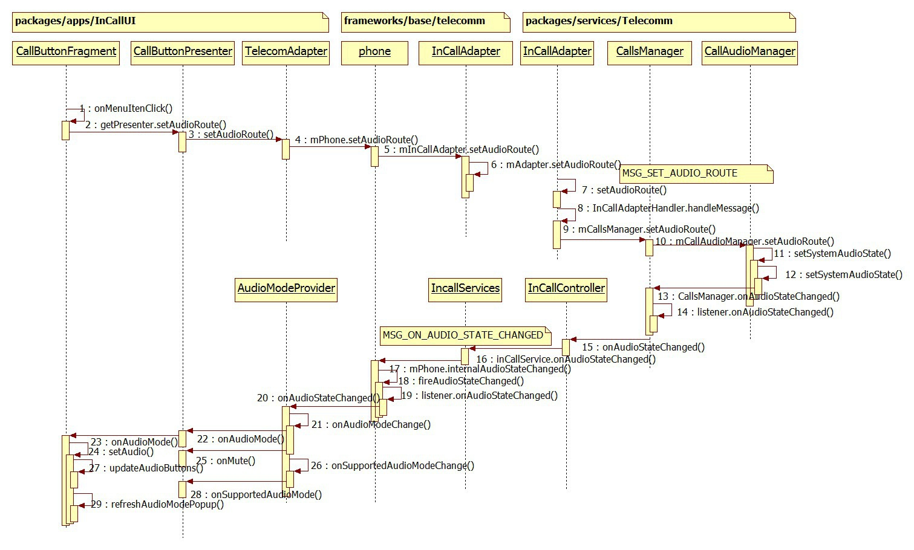
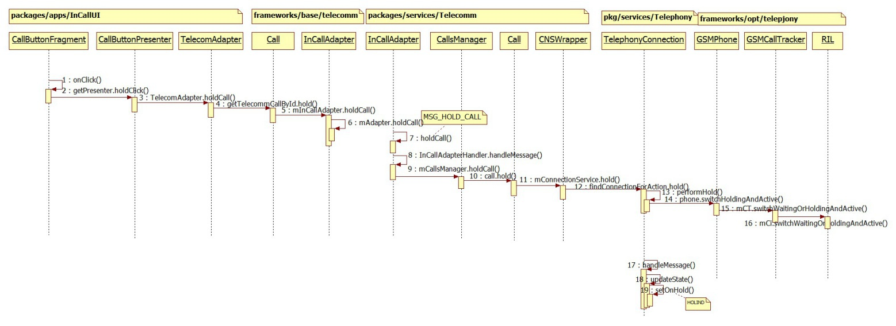
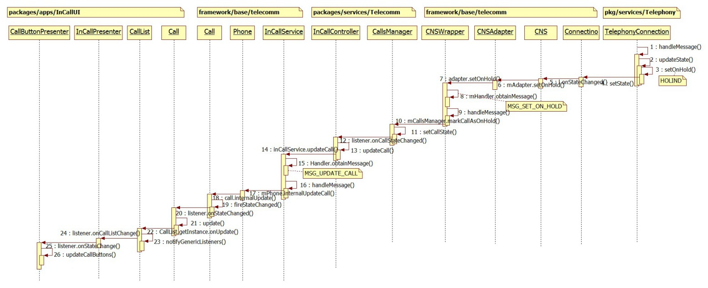

我们先来看一下CallButtonFragment在incall screen界面的位置，如下图：


大框里面就是CallButtonFragment，我们这次要说的东西也都在这里面。
从左到右 1. audioButton是显示当前通话声音从哪里传出去；2.muteButton点击以后收集不再录入自己这边的声音；3.dialpadButton换出号码盘；4.holdButton 通话保持 5.overflowButton包含添加通话，黑名单，通话录音等。
多数button都是只有checked和unchecked两种状态，其中audioButton和overflow两个要特殊点。

在连接了蓝牙耳机的时候audioButton是可选的状态，具体列出的选项我们下面会说。

然后overflow的选项的位置，如果只有一项的时候overflow会被替换为“添加通话”按钮，在多于一个以后显示overflowbutton，更多信息我们下面说。

#audioButton
##显示效果
连接蓝牙耳机

会有三个选项 “扬声器”、“手机听筒”、“蓝牙“（当前图标为选择了蓝牙）


连接蓝牙耳机+插入有线耳机

手机听筒会变为“有线耳机”


选择有线耳机和手机听筒后显示的图标是一样的


##负责显示的代码
看完了显示效果下面我们来说一下界面更新的相关的代码。CallButtonFragment.java中有三个比较重要的方法用来显示和更新显示audioButton和audioMode popMenu，它们分别是updateAudioButtons()，showAudioModePopup()和refreshAudioModePopup()。

1. updateAudioButtons()  选择一个图标显示在audioButton的位置。这里涉及到一个audioRoute优先级的问题，在连接了蓝牙耳机后会优先通过蓝牙耳机播放声音，也就表示这时候会显示蓝牙耳机的图标

	

	```java
        private void updateAudioButtons(int supportedModes) {
        final boolean bluetoothSupported = isSupported(AudioState.ROUTE_BLUETOOTH);
        final boolean speakerSupported = isSupported(AudioState.ROUTE_SPEAKER);

        boolean audioButtonEnabled = false;
        boolean audioButtonChecked = false;
        boolean showMoreIndicator = false;

        boolean showBluetoothIcon = false;
        boolean showSpeakerphoneIcon = false;
        boolean showHandsetIcon = false;

        boolean showToggleIndicator = false;

        if (bluetoothSupported) {//如果现在是支持蓝牙耳机的，那么需要显示“三角号”来表明有更多选项可选（此时最少三项）
            Log.d(this, "updateAudioButtons - popup menu mode");

            audioButtonEnabled = true;
            showMoreIndicator = true;
            // The audio button is NOT a toggle in this state.  (And its
            // setChecked() state is irrelevant since we completely hide the
            // btn_compound_background layer anyway.)

            // Update desired layers:
            if (isAudio(AudioState.ROUTE_BLUETOOTH)) {//如果当前通过蓝牙播放声音。则显示蓝牙图标
                showBluetoothIcon = true;
            } else if (isAudio(AudioState.ROUTE_SPEAKER)) {//如果是扬声器，则显示扬声器图标
                showSpeakerphoneIcon = true;
            } else {//否则显示 ic_toolbar_audio_phone 图标，听筒和有线耳机暂时都用的这个图标
                showHandsetIcon = true;
                // TODO: if a wired headset is plugged in, that takes precedence
                // over the handset earpiece.  If so, maybe we should show some
                // sort of "wired headset" icon here instead of the "handset
                // earpiece" icon.  (Still need an asset for that, though.)
            }
        } else if (speakerSupported) {
            Log.d(this, "updateAudioButtons - speaker toggle mode");

            audioButtonEnabled = true;

            // The audio button *is* a toggle in this state, and indicated the
            // current state of the speakerphone.
            audioButtonChecked = isAudio(AudioState.ROUTE_SPEAKER);

            // update desired layers:
            showToggleIndicator = true;
            showSpeakerphoneIcon = true;
        } else {
            Log.d(this, "updateAudioButtons - disabled...");

            // The audio button is a toggle in this state, but that's mostly
            // irrelevant since it's always disabled and unchecked.
            audioButtonEnabled = false;
            audioButtonChecked = false;

            // update desired layers:
            showToggleIndicator = true;
            showSpeakerphoneIcon = true;
        }

        // Finally, update it all!

        Log.v(this, "audioButtonEnabled: " + audioButtonEnabled);
        Log.v(this, "audioButtonChecked: " + audioButtonChecked);
        Log.v(this, "showMoreIndicator: " + showMoreIndicator);
        Log.v(this, "showBluetoothIcon: " + showBluetoothIcon);
        Log.v(this, "showSpeakerphoneIcon: " + showSpeakerphoneIcon);
        Log.v(this, "showHandsetIcon: " + showHandsetIcon);

        // Only enable the audio button if the fragment is enabled.
        mAudioButton.setEnabled(audioButtonEnabled && mIsEnabled);
        mAudioButton.setSelected(audioButtonChecked);

        final LayerDrawable layers = (LayerDrawable) mAudioButton.getBackground();
        Log.d(this, "'layers' drawable: " + layers);

        layers.findDrawableByLayerId(R.id.compoundBackgroundItem)
                .setAlpha(showToggleIndicator ? VISIBLE : HIDDEN);

        layers.findDrawableByLayerId(R.id.moreIndicatorItem)
                .setAlpha(showMoreIndicator ? VISIBLE : HIDDEN);

        layers.findDrawableByLayerId(R.id.bluetoothItem)
                .setAlpha(showBluetoothIcon ? VISIBLE : HIDDEN);

        layers.findDrawableByLayerId(R.id.handsetItem)
                .setAlpha(showHandsetIcon ? VISIBLE : HIDDEN);

        layers.findDrawableByLayerId(R.id.speakerphoneItem)
                .setAlpha(showSpeakerphoneIcon ? VISIBLE : HIDDEN);

    }
    ```

2. showAudioModePopup() 控制弹出显示的列表里的选项

    ```java
    private void showAudioModePopup() {
        Log.d(this, "showAudioPopup()...");

        final ContextThemeWrapper contextWrapper = new ContextThemeWrapper(getActivity(),
                R.style.InCallPopupMenuStyle);
        mAudioModePopup = new PopupMenu(contextWrapper, mAudioButton /* anchorView */);
        mAudioModePopup.getMenuInflater().inflate(R.menu.incall_audio_mode_menu,
                mAudioModePopup.getMenu());
        mAudioModePopup.setOnMenuItemClickListener(this);
        mAudioModePopup.setOnDismissListener(this);

        final Menu menu = mAudioModePopup.getMenu();

        // TODO: Still need to have the "currently active" audio mode come
        // up pre-selected (or focused?) with a blue highlight.  Still
        // need exact visual design, and possibly framework support for this.
        // See comments below for the exact logic.

        final MenuItem speakerItem = menu.findItem(R.id.audio_mode_speaker);
        speakerItem.setEnabled(isSupported(AudioState.ROUTE_SPEAKER));
        // TODO: Show speakerItem as initially "selected" if
        // speaker is on.

        // We display *either* "earpiece" or "wired headset", never both,
        // depending on whether a wired headset is physically plugged in.
        final MenuItem earpieceItem = menu.findItem(R.id.audio_mode_earpiece);
        final MenuItem wiredHeadsetItem = menu.findItem(R.id.audio_mode_wired_headset);

        final boolean usingHeadset = isSupported(AudioState.ROUTE_WIRED_HEADSET);
        earpieceItem.setVisible(!usingHeadset);//手机听筒和有线耳机只会显示一项
        earpieceItem.setEnabled(!usingHeadset);
        wiredHeadsetItem.setVisible(usingHeadset);
        wiredHeadsetItem.setEnabled(usingHeadset);
        // TODO: Show the above item (either earpieceItem or wiredHeadsetItem)
        // as initially "selected" if speakerOn and
        // bluetoothIndicatorOn are both false.

        final MenuItem bluetoothItem = menu.findItem(R.id.audio_mode_bluetooth);
        bluetoothItem.setEnabled(isSupported(AudioState.ROUTE_BLUETOOTH));
        // TODO: Show bluetoothItem as initially "selected" if
        // bluetoothIndicatorOn is true.

        mAudioModePopup.show();

        // Unfortunately we need to manually keep track of the popup menu's
        // visiblity, since PopupMenu doesn't have an isShowing() method like
        // Dialogs do.
        mAudioModePopupVisible = true;
    }
    ```

3. refreshAudioModePopup()用来更新点击audioButton后弹出的选项里面的内容，先dismiss已经显示的，再显示用showAudioModePopup()显示一个新的。比如插拔耳机的时候，把“有线耳机”和“听筒”互相转换。

    ```java
    public void refreshAudioModePopup() {
        if (mAudioModePopup != null && mAudioModePopupVisible) {
            // Dismiss the previous one
            mAudioModePopup.dismiss();  // safe even if already dismissed
            // And bring up a fresh PopupMenu
            showAudioModePopup();
        }
    }
    ```

上面这些只是负责初始化显示的代码，那么如果我们选择其中一项以后呢？
onMenuItemClick来判断选择了哪一项，并通过getPresenter().setAudioRoute(mode)，进一步调用到TelecommAdapter的setAudioRoute来设置audioRoute，选择相应的设备设置成功后，通过前面提到的updateAudioButtons()来更新，但要注意比较关键的一点，就是isAudio()和isSupported()的返回值都是正确的才能得到期望的效果。之前遇到一个bug，上层看起来都是正常的，但是会出现没连蓝牙耳机却显示蓝牙的现象，这就是由于较下层的地方没有更新正确的当前支持的audioRoute设备，导致上层以为所有的设备都是可用的。
setAudioRoute 以及更新的流程图：



第12步的时候设置audioRoute(或者设置mute)，更下层的工作交由framework/base/media的AudioManager完成，我们不继续深追。
这里通过CallsManager.getInstance().onAudioStateChanged()更新audio的变化
```java
 private void setSystemAudioState(
            boolean force, boolean isMuted, int route, int supportedRouteMask) {
        if (!hasFocus()) {
            return;
        }

        AudioState oldAudioState = mAudioState;
        saveAudioState(new AudioState(isMuted, route, supportedRouteMask));
        if (!force && Objects.equals(oldAudioState, mAudioState)) {
            return;
        }
        Log.i(this, "changing audio state from %s to %s", oldAudioState, mAudioState);

        // Mute.
        if (mAudioState.isMuted() != mAudioManager.isMicrophoneMute()) {
            Log.i(this, "changing microphone mute state to: %b", mAudioState.isMuted());
            mAudioManager.setMicrophoneMute(mAudioState.isMuted());
        }

        // Audio route.
        if (mAudioState.getRoute() == AudioState.ROUTE_BLUETOOTH) {
            turnOnSpeaker(false);
            turnOnBluetooth(true);
        } else if (mAudioState.getRoute() == AudioState.ROUTE_SPEAKER) {
            turnOnBluetooth(false);
            turnOnSpeaker(true);
        } else if (mAudioState.getRoute() == AudioState.ROUTE_EARPIECE ||
                mAudioState.getRoute() == AudioState.ROUTE_WIRED_HEADSET) {
            turnOnBluetooth(false);
            turnOnSpeaker(false);
        }

        if (!oldAudioState.equals(mAudioState)) {
            CallsManager.getInstance().onAudioStateChanged(oldAudioState, mAudioState);
            updateAudioForForegroundCall();
        }
    }
  ```

然后在向上更新的时候调用到了前面我们说到的三个比较重要的方法。
把上面的流程图简化一下我们得到：


注意telecomm层的Phond，因为audio route是不区分call的所以这里是通过phone操作的，而后面的hold则要区分call，所以中间的方法会带callId作为参数。

#muteButton
mute实际上也是对audio的设置，流程参考上面audio更改的流程图。在setSystemAudioState(boolean force, boolean isMuted, int route, int supportedRouteMask)中可以看到，第二个参数就是表示的mute，在AudioManager中的onAudioModeChange()中也用onMute向上更新了mute的状态。

#dialpadButton
这个比较简单，没有很复杂的逻辑，在InCallActivity中showDialpad()来显示或隐藏拨号盘。随着dialpadButton更新的还有endCallButton(CallCardFragment中的)。endCallButton 在代码中并不叫endcallButton，而是叫mFloatingActionButton，放在mFloatingActionButtonController里，放在mFloatingActionButtonController里的大小有两个值mFabNormalDiameter 和 mFabSmallDiameter，根据dialpad是否显示来选择用不同的值显示endCallButton。（PS：注意旋转屏幕切换系统语言等产生资源销毁重建时对dialpad显示的影响。）
#holdButton

设置hold
到达RIL.java后我们不继续深追了，这里要说名的一点是17步并不是紧接着16步之后的，而是向上更新的开始。那么什么时候开始向上更新的呢？我们知道hold call这个动作一定是在已经成功建立起一个call的基础上的，而call的连接在建立的时候会通过[RegistrantList消息处理机制](http://blog.csdn.net/aaa111/article/details/43833757)注册一个消息MSG_PRECISE_CALL_STATE_CHANGED，而在hold call成功后会TelephonyConnection会收到并进一步处理这个消息，在hold call的这个场景中便是向上更新hold的state。



hold成功向上更新



上面是设置成功的时序图，如果因为网络原因或者modem出错的话，hold是可能不成功的，这时候可能会看到两种现象，一个是holdButton显示checked后立刻回复unChecked，还一个是提示“Unable to switch call”

#overfloewButton
显示条件：Buttons数量大于5（CDMA大于4）的时候显示，我没有CDMA手机，不知道是少了哪一个button，
```java
	int maxButtonCount = (TelephonyManager.PHONE_TYPE_CDMA != phoneType) ?
                BUTTON_THRESOLD_TO_DISPLAY_OVERFLOW_MENU :
                BUTTON_THRESOLD_TO_DISPLAY_OVERFLOW_MENU - 1;
```
初始有3个：speaker，mute，dialpd。


选项除了下面两个还可能包括“通话录音”，在多路通话中“合并通话”也会在这里显示。如果开启了黑名单功能，一般也会收在这里。