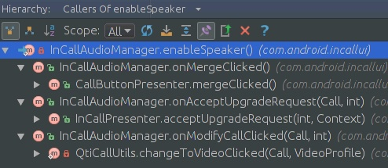
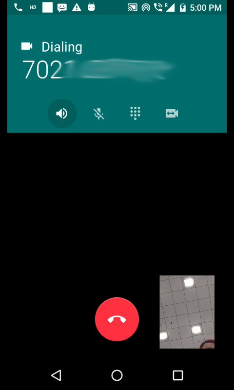
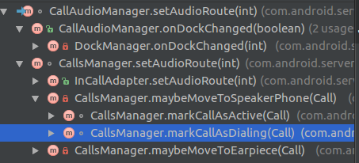

相关：
 
- [InCallScreen中CallButton界面更新介绍(audioButton等)](http://blog.csdn.net/aaa111/article/details/50364061)
- [Android L上VideoCall中Audio的管理](http://blog.csdn.net/aaa111/article/details/50937562)
- [Android M上VideoCall中Audio的管理](http://blog.csdn.net/aaa111/article/details/50992721)
- [CallAudioManager是如何工作的](http://blog.csdn.net/aaa111/article/details/51131053)
 
在前一篇中我简单介绍了在Android L 版本中Video Call中audio切换的一些信息，本篇以QCOM Release的Android M版本为基础看一下6.0上的Video Call中的audio相关变化。
##文件变化
比较明显的变化是 M上InCallUI中新增了一个类InCallAudioManager.java，见名知意，这是一个专门管理通话中Audio状态的类。
先看一下这个类里有那些方法：
 

图1: 文件结构
从方法名上可以大致看出这是一个管理call在 upgrade、modify和merge时候去开启扬声器或听筒的类。
先声明一点，enableSpeaekr()和enableEarpiece()两个方法不是被调用了就一定会产生AudioMode的变化，具体的判断条件我们放到最后再讲。
 
我们先看一下两个方法的调用层级：
##enableSpeaker() 的调用层级
 

图2： enableSpeaker()方法调用层级
上面这张图可解释为3个打开Speaker的场景：
1. 当点击合并通话时；
2. 当接受升级为视频电话是；
3. 当更改通话类型时。
 
其中第1种：当合并的两路通话中有一路是视频电话时打开Speaker：
```java
    /**
     * Called when user clicks on merge calls from the UI. Route audio to speaker if one of the
     * calls being merged is a video call.
     */
    public void onMergeClicked() {
        Log.v(this, "onMergeClicked");
 
        if (CallUtils.isVideoCall(CallList.getInstance().getBackgroundCall()) ||
                CallUtils.isVideoCall(CallList.getInstance().getActiveCall())) {
            enableSpeaker();
        }
    }
 
```
ModifyCall有两种情况，我们放到下面跟enableEarpiece一起说。
 
##enableEarpiece()的调用层级

图3: enableEarpiece()方法调用层级
可以看到打开听筒的唯一调用地方是ModifyCall，ModifyCallClicked()方法代码如下：
```java
    /**
     * Called when user sends an upgrade/downgrade request. Route audio to speaker if the user
     * sends an upgrade request to Video (bidirectional, transmit or receive) otherwise route
     * audio to earpiece if it's a downgrade request.
     */
    public void onModifyCallClicked(final Call call,final int newVideoState) {
        Log.v(this, "onModifyCallClicked: Call = " + call + "new video state = " +
                newVideoState);
 
        if (!VideoProfile.isVideo(newVideoState)) {
            enableEarpiece();
        } else if (canEnableSpeaker(call.getVideoState(),newVideoState)) {
            enableSpeaker();
        }
    }
 
```
可解释为：升级为视频电话时打开Speaker，降级时打开Earpiece。
 
##实际AudioMode是否变换？
前面我们说过及时调用了这两个方法也不会一定产生AudioMode的变化，enableSpeaker()方法前的注释里已经写得很清楚了。
**当现在蓝牙和有线耳机没有连接，且当前audio不是通过Speaker传送的话，打开Speaker。**听筒同理。
（我觉得QtiCallUtils.isEnabled()方法有点意思，可以打开看看）
```java
    /**
     * Routes the call to the speaker if audio is not being already routed to Speaker and if
     * bluetooth or wired headset is not connected.
     */
    private static void enableSpeaker() {
        final TelecomAdapter telecomAdapter = TelecomAdapter.getInstance();
        if (telecomAdapter == null) {
            Log.e(LOG_TAG, "enableSpeaker: TelecomAdapter is null");
            return;
        }
 
        final int currentAudioMode = AudioModeProvider.getInstance().getAudioMode();
        Log.v(LOG_TAG, "enableSpeaker: Current audio mode is - " + currentAudioMode);
 
        if(!QtiCallUtils.isEnabled(CallAudioState.ROUTE_SPEAKER |
                CallAudioState.ROUTE_BLUETOOTH | CallAudioState.ROUTE_WIRED_HEADSET,
                currentAudioMode)) {
            Log.v(LOG_TAG, "enableSpeaker: Set audio route to speaker");
            telecomAdapter.setAudioRoute(CallAudioState.ROUTE_SPEAKER);
        }
    }
```
 
---
##补充
到这就完了么？上面我们从代码中推出了一些场景以及实现，那么在实际使用中以现有的代码能满足用户需要么？
这个问题先留在这，等后面如果项目上有报相关的bug的时候我再来更新。
1. **视频电话降级为语音电话关闭Speaker**
     这个我在前一篇博客中写到过，不过依现在M上的代码来看，只有发起降级的一端会关闭Speaker，接收端的AudioMode貌似不会更改。不过这种现象也可以理解，对方没有准备的情况下，扬声器突然关掉了的话，而假如用户又没有意识到的话，会听不到通话另一方的声音的。

---

2016.05.27 更新

看图

上图中可以看出，在正在拨号的界面Speaker的状态就已经是打开的了，而从上面的分析中却没有代码执行对应的动作，那么这个Speaker是在什么地方打开的呢？
CallsManager.java
```java
    /**
     * Checks to see if the call should be on speakerphone and if so, set it.
     */
    private void maybeMoveToSpeakerPhone(Call call) {
        if (call.getStartWithSpeakerphoneOn()) {
            setAudioRoute(CallAudioState.ROUTE_SPEAKER);//打开Speaker
            call.setStartWithSpeakerphoneOn(false);
        }
    }

    private void maybeMoveToEarpiece(Call call) {
        if (!call.getStartWithSpeakerphoneOn() && !mWiredHeadsetManager.isPluggedIn() &&
                !mCallAudioManager.isBluetoothDeviceAvailable()) {
            setAudioRoute(CallAudioState.ROUTE_EARPIECE);//打开听筒
        }
    }
```
调用层级：

上面的代码解释了，在拨号界面Speaer就打开的原因。
在CallsManager.java中新增了多个方法，上面只是其中一部分，实现的功能也是控制Speaker和Earpiece的开关，里面用的值是在哪里设置的呢？
```java
 /**
     * Attempts to issue/connect the specified call.
     *
     * @param handle Handle to connect the call with.
     * @param gatewayInfo Optional gateway information that can be used to route the call to the
     *        actual dialed handle via a gateway provider. May be null.
     * @param speakerphoneOn Whether or not to turn the speakerphone on once the call connects.
     * @param videoState The desired video state for the outgoing call.
     */
    void placeOutgoingCall(Call call, Uri handle, GatewayInfo gatewayInfo, boolean speakerphoneOn,
            int videoState) {
//...
        // Auto-enable speakerphone if the originating intent specified to do so, or if the call
        // is a video call or if the phone is docked.
        call.setStartWithSpeakerphoneOn(speakerphoneOn || isSpeakerphoneAutoEnabled(videoState)
                || mDockManager.isDocked());
        call.setVideoState(videoState);
//...
}
```
可以看到在placeOutgoingCall()中增加的这段代码自动打开了speakerphone 。

##总结
回顾以前的代码，加上今天更新的内容，可以得到一个信息：在Android M上，通话中AudioRoute的控制，在InCallUI部分全新改写，跟enterVideoMode()和exitVideoMode()两个方法没有直接关系。同时不止存在于InCallUI层，Telecomm的CallsManager也牵扯进来了。