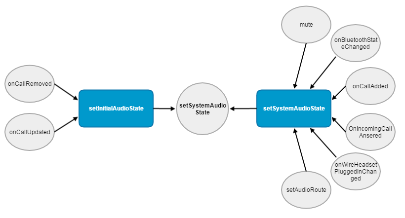

CallAudioManager是干啥的呢？单词分来来写 Call Audio Manager，一个管理通话中音频状态的类。
#初始化
一张图看清CallAudioManager怎么来的 。


在TeleService创建的时候对TelecomGlobals进行初始化，然后new出一个CallsManager，在CallsManager.java的构造函数中new出一个CallAudioManager()，带三个参数CallAudioManager(context, statusBarNotifier, mWiredHeadsetManager)。
#文件结构
然后看一下CallAudioManager的继承和实现关系
`CallAudioManager extends CallsManagerListenerBase
        implements WiredHeadsetManager.Listener {`
CallAudioManager.java继承CallsManagerListenerBase.java（其实就是CallsManager的CallsManagerListener接口），实现WiredHeadsetManager.Listener()，
因此它重写了CallsManagerListenerBase中的一系列方法，实现了WiredHeadsetManager的接口onWiredHeadsetPluggedInChanged()，见下图：

从这张图里面我们可以大致了解到CallAudioManager关心的一些事情，在Call发生变化的时候，在
有线耳机插入/拔出的时候，这个类会做一些操作设置，保存或者更新Audio的一些信息。看到onWiredHeadsetPluggedInChanged()这个方法，可能有些人就想到 了，既然有一个方法关心有线耳机的插入/拔出状态的变化，那怎么没有一个方法处理**蓝牙耳机**连接/断开的状态呢？实际上是有的，只不过它不是像有线耳机那样是通过实现接口实现的，而是在内部写了几个方法监听处理蓝牙的状态，其中一个与有线耳机插入/拔出对应的方法就是onBluetoothStateChange()。
通过下面这段CallAudioManager的构造函数可以看到，在CallAudioManager初始话的时候new了一个BluetoothManager()，
```java
    CallAudioManager(Context context, StatusBarNotifier statusBarNotifier,
            WiredHeadsetManager wiredHeadsetManager) {
        mStatusBarNotifier = statusBarNotifier;
        mAudioManager = (AudioManager) context.getSystemService(Context.AUDIO_SERVICE);
        mBluetoothManager = new BluetoothManager(context, this);
        mWiredHeadsetManager = wiredHeadsetManager;
        mWiredHeadsetManager.addListener(this);

        saveAudioState(getInitialAudioState(null));
        mAudioFocusStreamType = STREAM_NONE;
        mContext = context;
    }
```
而WiredHeadsetManager()却是在CallsManager初始化的时候跟CallAudioManager一起被new出来的，感觉WiredHeadset和Bluetooth两者不平级一样，暂时不知道是出于什么考虑。
```java
    /**
     * Initializes the required Telecom components.
     */
     CallsManager(Context context, MissedCallNotifier missedCallNotifier,
                  BlacklistCallNotifier blacklistCallNotifier,
                  PhoneAccountRegistrar phoneAccountRegistrar) {
...
        mWiredHeadsetManager = new WiredHeadsetManager(context);
        mCallAudioManager = new CallAudioManager(context, statusBarNotifier, mWiredHeadsetManager);
...
    }
```
这是一个管理通话中音频状态的类，那么它必然要设置新的状态，并把状态的变化通知出去。由此因此这个类中可能是最重要的一个方法**setSystemAudioState()**,
```java
    private void setSystemAudioState(
            boolean force, boolean isMuted, int route, int supportedRouteMask) {
        if (!hasFocus()) {
            return;
        }

        AudioState oldAudioState = mAudioState;
        saveAudioState(new AudioState(isMuted, route, supportedRouteMask));
        if (!force && Objects.equals(oldAudioState, mAudioState)) {
            return;
        }
        Log.i(this, "changing audio state from %s to %s", oldAudioState, mAudioState);

        // Mute.
        if (mAudioState.isMuted() != mAudioManager.isMicrophoneMute()) {
            Log.i(this, "changing microphone mute state to: %b", mAudioState.isMuted());
            mAudioManager.setMicrophoneMute(mAudioState.isMuted());
        }

        // Audio route.
        if (mAudioState.getRoute() == AudioState.ROUTE_BLUETOOTH) {//设为蓝牙
            turnOnSpeaker(false);
            turnOnBluetooth(true);
        } else if (mAudioState.getRoute() == AudioState.ROUTE_SPEAKER) {//扬声器
            turnOnBluetooth(false);
            turnOnSpeaker(true);
        } else if (mAudioState.getRoute() == AudioState.ROUTE_EARPIECE ||
                mAudioState.getRoute() == AudioState.ROUTE_WIRED_HEADSET) {//听筒或者有线耳机
            turnOnBluetooth(false);
            turnOnSpeaker(false);
        }

        if (!oldAudioState.equals(mAudioState)) {
            CallsManager.getInstance().onAudioStateChanged(oldAudioState, mAudioState);
            updateAudioForForegroundCall();
        }
    }
```
前面所有执行的步骤到最后几乎都是为了执行到这个方法里，去打开/关闭Speaker，“打开/关闭”蓝牙，然后把状态的变化通知出去。这里并没有单独写一个方法通知状态的变化，只是在这个方法内调用了`CallsManager.getInstance().onAudioStateChanged(oldAudioState, mAudioState);`。
值得注意的是turnOnSpeaker(true)是通过mAudioManager.setSpeakerphoneOn(on);的方式，而turnOnBluetooth(true);则是通过mBluetoothManager.connectBluetoothAudio();的方式，蓝牙不归AudioManager管？想想也对，有可能是连接的蓝牙键盘呢。
另外有一点，切换到听筒和有线耳机的方法居然后把扬声器和蓝牙都关掉。
#CallAudio更新
起先我是想写“audio更新”的，但是为什么改成“CallAudio更新”呢？因为这个audio跟call的关系太密切了，可以说call不存在audio就不存在，而且Android M上很多跟call有关的audio相关的类，都由Audio更名为CallAudio了（如AudioState.java -> CallAudioState.java）。
前面说到这个类里面最重要的方法是setSystemAudioState()，那么看一下调用层级：


然后画成示意图的形式：


结合代码对上图解读一下。（圆形的setSystemAudioState(）和右侧的圆角长方形方法同名，携带参数不一样）
左侧的圆角长方形表示“设置为默认的audio state”调用这个方法的时候，不用携带audio相关的参数，方法内会自己生成一个初始化的audioState。两个椭圆代表的场景是“所有通话被移除，恢复默认值”，和“满足‘从不是VoiceCall到VoiceCall’的时候设置一个初始化的audioState”。
右侧圆角长方形表示“设置audio state”，调用这个方法带4个参数，分别是：强制设置，是否mute，audioState，当前所有支持的audioState。
最右侧6个椭圆中只有最下面的setAudioRoute(）是手动设置，我们在InCallUI界面上操作都是从这个入口传进来的。其余可以认为是自动设置。
#AudioState
下面我们再说一下最关键的一个变量mAudioState。
mAudioState这个变量几乎携带了所有的audio相关的信息，关键的两个：
```java
    /**
     * @return The current audio route being used.  //当前audio传输使用的方式
     */
    public int getRoute() {
        return route;
    }

    /**
     * @return Bit mask of all routes supported by this call. //当前所有支持的传输方式
     */
    public int getSupportedRouteMask() {
        return supportedRouteMask;
    }
```
在上面我们说过，audioState发生变化时是通过`CallsManager.getInstance().onAudioStateChanged(oldAudioState, mAudioState);`这行代码更新的，可以理解为把mAudioState的值广播出去。mAudioState可以理解为数据的源头，一旦mAudioState除了问题，那么上层肯定会出现问题。
（铃声存在时间超出call的生命周期）
但是现有代码中，在没有没有call和没有铃声的时候，这个值是不会更新的（注①），所以这将会导致一个问题，什么问题呢？读者们不妨想一下。
问题是，在call和铃声不存在时，插拔耳机，连接/断开蓝牙耳机导致的audio变化不会更新到mAudioState中，进而上层也不会知晓audioState状态的变化，也就导致audioButton显示错误。这个现象只在来电状态可以看到，来电被接听后audioButton显示正常，因为在onIncomingCallAnswered()里会setSystemAudioState()然后更新audioState。
思考一下解法？（勿扰模式，多路通话）

---
04.14补充 
我们发现在Android M 版本上，先建立一路通话，打开Speaker，然后新增一路通话，会使打开着的Speaker关闭。 
查找提交发现，commit信息中写到

>Route audio to earpiece in DIALING state if call is a Voice call and 
bluetooth or wired headset is not connected. This fixes an issue where 
if we make a first video call and second outgoing call is voice, audio 
is routed to speaker which is not expected.

在之前的audio相关的博客中我介绍过在视频电话中Speaker的一些使用策略，上面commit message中提到的也是“第一通是视频电话，第二通是语音电话”的场景，但是我们发现实际使用的时候，两个都是语音电话的情况下也会关闭。 
其实这里到不存在对错，只是可能需要重新考虑一下audio切换的策略。还有需要看一下上面那条提交是否准确实现了他想要的效果。