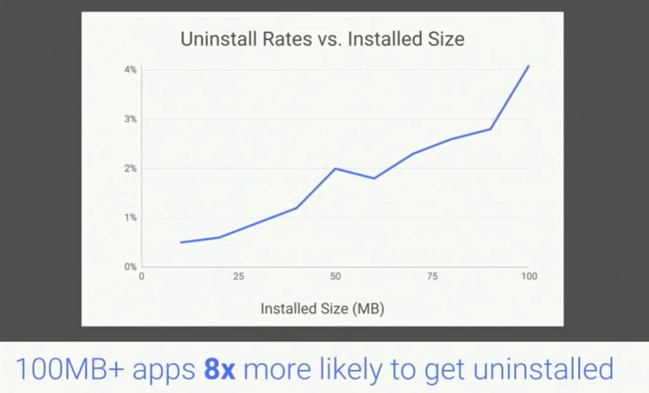
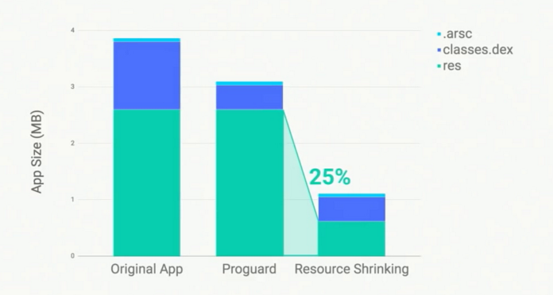
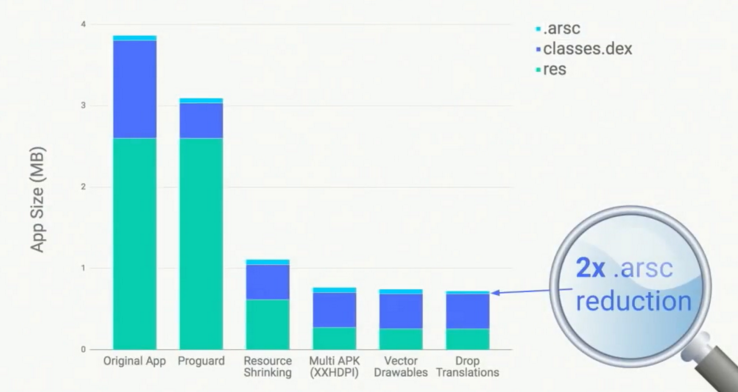
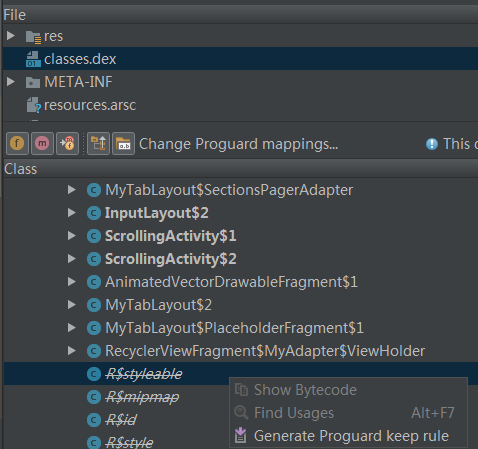

本文内容主要来自Google I/O 17 [Best Practices to Slim Down Your App Size (Google I/O '17)](https://www.youtube.com/watch?v=AdfKNgyT438)，有删改。介绍现有的和Google新带来的一些给APK瘦身的方法（其实是拿之前做分享的PPT改的）。

**因文本内容的局限性，不能展示实际操作演示，想看具体的演示请点击上面的链接。**
开始之前提个问题，你们知道用Android Studio新建一个HelloWorld然后build apk出来的apk体积有多大？500K? 1M? 5M?（我做分享的时候有人甚至提到10M）
一个什么都不加HelloWorld工程build出一个apk已经1.5M了，试想一个完整的上线项目如果不做任何优化将有多大？是不是开始想给你的应用瘦身了？
# Two Dimensions of apk size
两种意义上的apk大小
1. download size
   下载大小 ，即我们从应用商店下载的apk安装包所需的流量大小（实际下载消耗数据量可能和apk安装包体积不一致）
   
2. Install size
   安装大小，即安装后大小。apk安装包在经过解压，编译和优化后在磁盘空间中实际占用的大小。
   

为什么你需要减小apk体积？我看们一下下面两个表
当应用体积达到100M的时候，有约20%的概率用户会取消应用的下载。

当应用安装后大小超过100M的时候，它被卸载的概率是安装后大小为10M的8倍左右。

因此小的应用体积可以提高应用的下载率和留存率，也就是提高了应用的成功率。
接下来总结一些已有的减小apk大小的方法，介绍一些新的方法。
介绍方法前，先了解一下apk组成，下图是用Android Studio 3.0“Analyze APK...”打开的一个apk。
 
res目录下存放资源文件，包括图片，布局等，classes.dex是编译后的java代码，展开可显示类名，方法名，具体代码是看不到的，可能还有classes1.apk等，resources.arsc里面存的是各种资源ID和对应的Name。

# Existing Functionality
听这次分享不是要强行记住这些缩减apk体积的特殊步骤，而是你要开始优化自己应用程序的大小，找出哪一部分占据的空间较大并开始着手裁剪。
## 1. Proguard
这个一般被称为代码混淆，默认在release版本中启用，proguard是一个完整的java代码优化。
启用方法：
 
Proguard的三个主要作用：
1. 优化代码 在不改变功能的情况下优化代码是代码更加紧凑,比如内连一些方法的调用点。
2. 混淆 混淆类型，方法和字段名，长名称替换成短名称。
3. 消除dead code（重要）
   proguard检测代码，推定代码为dead code后会把代码重程序中删除
   
   假如我们引用了一些库，但我们使用的只是其中一部分代码，progurad删除了我们引用的库中不需要的代码。
   但是有时候proguard做出的判断并不是完全正确的，它有可能移除我们真正需要的代码，此外还有另一个影响，就是上面2说到的“长名称”替换成“短名称”，这给代码调试带来困难，关于这两个问题我们后面接着说（APK Analyzer）。

启用proguard之后体积变化：
   
**注：**上图和以下所有效果图来自google samples应用[Topeka](https://github.com/googlesamples/android-topeka)，但是截止到现在，github上的仓库里并没有这些slim down apk size的提交。

## 2. shrinkResources
压缩资源
shrinkResources扩展了proguard的理念。proguard移除的是无用代码，shrinkResources移除的是无用的资源。
启用方法：
 
live code中引用的drawable被保留，其他的被删除  

启用后体积变化：
 
效果显著 哈哈哈哈

## 3. Build Multiple APKs
构建多个apk，我们知道设备之间会有很多不同，比如cpu架构，屏幕分分辨等，通常我们构建的都是通用的apk（Universal apk），即一个apk适用于所有设备，但实际上对于特定的设备来说，它只需要其中一部分资源。因此我们可以分开打包资源生成多个apk。
启用方法：
 
坏处 增加构建和发布成本。因为可能要分别调试，还要上传多个版本到应用商店。
Universal apk ，通用apk，也就是我们长构建的一个apk运行在所有设备上。假设我们的目标设备的分边路是XXHDPI，那么蓝色部分才是我们需要的资源。
 
启用后体积对比：
 
仅包含XXHDPI资源的apk, res体积减小原来的到44%，如果是hdpi或mdpi的话效果会更明显。

## 4. Use Vector Drawables
使用矢量图代替位图
启用方法：
 
一个资源适用于所有设备。即使是最小的mdpi的png图片也大于Vector Drawable图片，那一个Vector Drawable将远小于这些png资源之和。 
Support Library 23.2向前兼容API 14，SDK 24+版本支持渐变（这个Gradient是什么没查到）
**谨记：**使用矢量图的时候会增加内存和cpu的使用量，尤其是第一次启动app的时候。
当你的apk里面有很多较为复杂的矢量图的时候，请做性能测试，不要为了减小apk体积而牺牲性能。 
效果： 

## 5. Exclude Sparse Translations
只打包特定的语言 有些应用是国际化的，那么这个应用的资源中可能就包含多语言，但如果语言翻译不完整，这反而是会降低用户体验的。另外假如你发布的应用只需要一种语言（有些lib里面可能有多语言），你可以用下面的方法只打包一种语言资源。 
一行代码减小arsc文件
 
体积对比，请拿起你手中的放大器放大看看，arsc现在体积减少了1/2。 
OK，现在为止apk体积已经减少为原来的1/5，而现在还没10点呢！

# New Stuff
## 1. Use Download fonts 
 使用可下载字体
Google调查了play上下载排名前25的应用，大多数为了丰富显示效果，UI设计都使用了额外的字体。
这些应用在apk内绑定了需要的字体，大量应用绑定额外字体，而且这些字体可能是重复的，从系统的角度讲这其实很占用空间的，也是一种资源浪费。因此Google提出了可下载字体来减少这部分空间。
Android O提供一个Font Provider，apk不用再绑定字体，由这个provider向应用提供字体，这是系统中惟一一个需要下载字体的东西。
从下面的架构图可以看出，app通过FontsContract这个api去请求字体，Font Prodiver从Play Services去下载字体并缓存Font cache，之后再有应用需要这种字体则从缓存中取，做到一份字体提供给所有应用使用。
因应用不需在apk内绑定字体，所以减小了apk体积，也就减小了下载应用使用的网络数据，减小磁盘占用。
Google Fonts team提供其拥有的所有字体，800+！
 
要支持这个功能需要使用Andorid O, 或者Support Library 26 beta 1，且Google Play Services要V11版本，构建应用需使用Android Studio 3.0，使用方法的话，下图选中了一个TextView然后选fontFamily，看图吧： 
 

## 2. AAPT2
 AAPT即Android Asset Packaging Tool，在AS 3.0上启用方法（前面都是改build.gradle，这个是改gradle，properties）
 
2.1 version collapsing
随着应用版本迭代，所支持的mini SDK升级，但是代码中仍然保留了低版本的配置，AAPT2可以根据当前mini SDKbane版本只打包需要的资源。 

2.2 Resource deduplication 
简单说就是删除翻译一样的字符串，使用默认/相同的字符串。
 

## 3. Dex viewer 
这个其实并不是apk瘦身的方法，这是分析apk的辅助工具。如果你的apk在瘦身（混淆）后运行crash，你可能会需要这个工具。
还记得前面再说Proguard遗留的问题吗？proguard删除了需要使用的代码？名称混淆后不好调试？
 
a. 界面优化；
b. 现在支持同时选中多个dex文件（有些apk解包以后里面会有多个dex文件，形如classes2.dex）；
c. 可以查看每个类占用空间大小（后续版本支持）；
d.查看方法调用。你可能会看到默认的不是你添加的方法，想要知道它怎么被引进来的，使用这个功能吧；
**e. 加载代码混淆映射文件**。用于查看被混淆的代码的源名称，构建启用proguard的apk是会生成mapping文件，加载mapping文件可以查看短名称类名方法名的原名，以及被移除的节点（类），然后可以生成keep这些节点的rule，见h；
f. Deobfuscate names 混淆后的短名称显示成原长名称；
**g. 利用e可以查看哪些节点（类方法）被移除；**
**h. 在被移除的节点上右键可以生成proguard的keep rules，**从而保留代码不被remove；
**强烈建议看原视频**，这部分的演示，文字不好描述，这一段开发者们鼓了好几次掌。

贴几张图吧，下面都是我自己demo的截图。
对应e 点击加载mapping文件夹，之后可以看到再下一张图的样子。适用于apk在a类crash但不知a是哪个类。

对应f 点左边这个按钮把短名称还原成原长名称显示。

对应h 生成keep rule，复制到proguard-rules.pro文件， 下次编译apk的时候文件就得以保留，适用于应用运行时找不到类。

## 4. Google Play App Signing
开发者把签名文件发给Google Play，由Play商店替你生成适合当前设备的apk。 这和前面的构建多个apk类似。
 
 
效果（不想打字了，看图吧）  
目前位置都是开发者可参与的，接下来有两个在play服务端的优化

## 5. Smaller Apps from Google Play
5.1 使用Brotli compression 压缩算法
这个算法在2015年就出现了，这次是把它应用到了Google Play上。 

Google欧洲研究团队的实习生项目（是漂亮的小姐姐哦，感兴趣的可以搜一下），把Brotli压缩算法应用到Play商店（之前gzip）

5.2 File by File patching
更有效的生成patch的方案，平均下来新patch的体积比完整的应用减小了65%。
 
 效果 还是看图

启用新的生成patch方式后，每日减小6PB的数据使用。加上之前的1.5PB，减小的7.5PB（每日）相当于100年HDTV播放使用的数据量！

# Summary
已存在的都是依靠应用本地构建时的优化，Google带来的新技术有几个依靠于网络服务，需结合Play商店服务（这也就意味着有些方法我们用不了）。